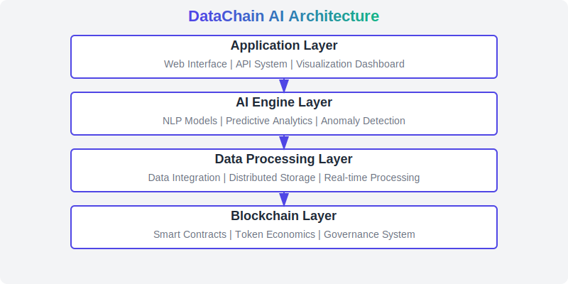

# DataChain AI - 去中心化AI驱动的数据分析平台

<div align="center">
  
  
  [](https://opensource.org/licenses/MIT)
  [](https://datachain.ai)
  [](https://x.com/DataChain_AI)
  [](https://github.com/code1984/DataChain/releases/tag/v1.0.1)
</div>

## 🔑 概述

DataChain AI是一个构建在Solana区块链上的去中心化、AI驱动的数据分析平台。它将先进的人工智能与区块链技术相结合，创建了一个创新的数据分析生态系统，通过基于代币的经济模型激励所有参与者共同构建平台价值，使数据分析变得更加智能、高效和有价值。

DataChain AI解决了数据分析领域的三大主要挑战：
1. **数据孤岛**：通过安全集成打破企业数据隔离
2. **分析复杂性**：通过AI使专业数据洞察变得易于访问
3. **价值分配**：通过DATA代币奖励数据贡献者和AI模型开发者

### 核心特性

- **AI驱动分析**：自动数据洞察和模式发现
- **自然语言查询**：用普通语言提问并获得数据驱动的答案
- **去中心化数据市场**：安全共享和交易匿名化数据
- **AI模型市场**：贡献专业AI模型并获得代币奖励
- **智能合约自动化**：基于数据条件触发业务流程
- **跨平台支持**：具有全面API支持的Web应用
- **低交易费用**：利用Solana的高吞吐量和低交易成本

## 🚀 快速开始

### 前提条件

- Node.js (v16+)
- npm (v8+)
- Rust (v1.65+)
- Solana CLI (v1.16+)
- Python 3.9+ (用于AI组件)
- 拥有SOL用于交易费用的Solana钱包
- Docker和Docker Compose（可选，用于容器化部署）

### 安装

```bash
# 克隆仓库
git clone https://github.com/code1984/DataChain.git
cd DataChain

# 复制环境配置文件
cp ./DataChain-AI/.env.example .env
# 编辑.env文件进行配置

# 安装前端依赖
cd DataChain-AI/frontend
npm install

# 安装后端依赖
cd ../backend
npm install

# 安装AI引擎依赖
cd ../ai-engine
pip install -r requirements.txt
```

### 启动开发服务

您可以分别启动各个组件进行开发：

```bash
# 启动前端开发服务
cd DataChain-AI/frontend
npm start

# 启动后端服务
cd DataChain-AI/backend
npm run dev

# 启动AI引擎
cd DataChain-AI/ai-engine
python -m src.app
```

或者使用Docker Compose启动整个项目：

```bash
# 在项目根目录
cd DataChain-AI
docker-compose up
```

有关详细开发说明，请参阅我们的[开发者指南](./DataChain-AI/docs/developer-guide.md)。

## 🏗️ 架构

DataChain AI由四个主要层次组成，共同提供完整的数据分析生态系统：

<div align="center">
  
</div>

### 区块链层
基于Solana的智能合约系统管理：
- DATA治理代币
- 数据资产代币化和交易
- 去中心化治理机制
- 验证者声誉系统

### 数据处理层
处理数据摄取、存储和处理：
- 数据集成连接各种数据源
- 分布式存储提供适当的访问控制
- 实时处理支持即时分析

### AI引擎层
平台的智能核心，提供先进的分析能力：
- 自然语言处理实现与数据的对话交互
- 预测分析基于历史数据预测未来趋势
- 异常检测识别数据中的异常模式
- 洞察生成自动发现有意义的模式

### 应用层
用户接口组件，提供对平台功能的访问：
- 基于浏览器的Web界面
- 程序化访问API系统
- 交互式数据可视化仪表板

## 🖥️ 用户界面

DataChain AI提供了直观、美观的用户界面，包括以下主要页面：

### 登录和首页
- 简洁的登录界面，支持钱包连接
- 展示平台主要功能和价值的登录页
- 个性化仪表板，显示用户数据和活动

### 数据分析仪表板
- 交互式数据可视化界面
- 自然语言查询输入框
- 实时数据洞察和分析结果展示

### 数据市场
- 浏览和搜索可用数据集
- 详细的数据集预览和元数据
- 购买和访问管理功能

### AI模型市场
- 多种AI模型分类展示
- 模型性能和用途说明
- 使用和贡献模型的界面

### 治理界面
- 活跃提案列表和详情
- 投票界面和结果展示
- 提案创建和管理功能

### 用户配置文件
- 个人信息管理
- 数据集和模型贡献概览
- 交易历史和账户设置

## 📊 代币经济学

DATA代币是DataChain AI平台的原生功能型代币：

- **总供应量**: 100,000,000 DATA
- **分配**:
  - 生态系统激励 (35%): 35,000,000 DATA
  - 团队和顾问 (15%): 15,000,000 DATA
  - 早期投资者 (20%): 20,000,000 DATA
  - 平台开发 (15%): 15,000,000 DATA
  - 社区建设 (10%): 10,000,000 DATA
  - 流动性储备 (5%): 5,000,000 DATA

DATA代币在生态系统中提供多种功能：

- **平台访问**：高级分析功能和API使用
- **数据市场**：购买和销售数据集访问权限
- **AI模型市场**：使用和贡献专业AI模型
- **治理**：参与平台决策和投票
- **费用减免**：代币持有者享受平台费用折扣

## 🔍 数据验证

DataChain AI实施严格的数据验证过程：

1. **初始提交**：文档收集和初步审查
2. **专家评估**：行业专家评估
3. **价值确认**：正式评估和价值确定
4. **验证**：完整性和合规性检查
5. **授权**：最终审查和批准
6. **持续验证**：定期重新评估和更新

有关详细信息，请参阅我们的[数据验证文档](./DataChain-AI/docs/data_verification.md)。

## 🏛️ 治理

DataChain AI治理系统使代币持有者能够参与平台决策：

- **提案创建**：提交平台变更提案
- **讨论期**：社区对提案的审议
- **投票期**：按代币权重对提案进行投票
- **执行**：自动或手动实施已批准的变更

有关详细信息，请参阅我们的[治理框架](./DataChain-AI/docs/governance.md)。

## 🔌 API参考

DataChain AI提供全面的API，供开发者在我们的平台上构建应用：

### RESTful API端点

- **数据集API**：管理和访问数据集
  ```
  GET /api/v1/datasets
  GET /api/v1/datasets/{id}
  POST /api/v1/datasets
  POST /api/v1/datasets/{id}/purchase
  ```

- **分析API**：数据分析和洞察
  ```
  POST /api/v1/analysis/analyze
  POST /api/v1/analysis/query
  POST /api/v1/analysis/predict
  ```

- **AI模型API**：访问和使用模型
  ```
  GET /api/v1/models
  GET /api/v1/models/{id}
  POST /api/v1/models/{id}/use
  ```

### 客户端SDK

```javascript
// 示例：检索数据集详情
const { DataChainClient } = require('@datachain/sdk');

const client = new DataChainClient({
  apiKey: 'your-api-key',
  environment: 'production'
});

async function getDatasetDetails(datasetId) {
  const dataset = await client.datasets.get(datasetId);
  console.log(dataset);
}
```

完整API文档，请参阅我们的[API参考](./DataChain-AI/docs/api.md)。

## 📁 项目结构

```
DataChain-AI/
├── contracts/                    # Solana智能合约
│   ├── src/                      # 合约源代码
│   │   ├── lib.rs                # 合约入口点
│   │   ├── data_token.rs         # DATA代币合约
│   │   ├── data_marketplace.rs   # 数据市场合约
│   │   ├── ai_models.rs          # AI模型市场合约
│   │   └── governance.rs         # 治理系统合约
│   └── tests/                    # 合约测试
├── frontend/                     # React前端应用
│   ├── src/                      # 源代码
│   │   ├── components/           # UI组件
│   │   │   └── layout/           # 布局组件
│   │   ├── pages/                # 页面组件
│   │   │   ├── Dashboard.js      # 数据分析仪表板
│   │   │   ├── DataMarketplace.js# 数据市场
│   │   │   ├── AIModels.js       # AI模型市场
│   │   │   ├── Governance.js     # 治理系统
│   │   │   ├── TokenInfo.js      # 代币信息
│   │   │   ├── Profile.js        # 用户配置文件
│   │   │   └── Landing.js        # 登录页
│   │   └── ...
│   └── ...
├── backend/                      # Node.js后端服务
│   ├── src/                      # 源代码
│   │   ├── routes/               # API路由
│   │   │   ├── datasets.js       # 数据集API
│   │   │   ├── analysis.js       # 分析API
│   │   │   ├── models.js         # 模型API
│   │   │   └── ...
│   │   ├── middleware/           # 中间件
│   │   └── ...
│   └── ...
├── ai-engine/                    # AI分析引擎
│   ├── src/                      # 源代码
│   │   ├── models/               # AI模型
│   │   ├── processors/           # 数据处理器
│   │   ├── insights/             # 洞察生成器
│   │   └── ...
│   └── ...
├── docs/                         # 文档
│   ├── architecture.md           # 架构文档
│   ├── api.md                    # API文档
│   ├── tokenomics.md             # 代币经济细节
│   └── whitepaper.md             # 项目白皮书
├── scripts/                      # 部署和实用脚本
├── shared/                       # 组件间共享代码
└── assets/                       # 项目资产
```

## 📅 路线图

### 第1阶段：基础 (2023年第2季度)
- ✅ 概念验证（白皮书、MVP）
- ✅ 核心智能合约开发
- ✅ 代币发行和分配机制

### 第2阶段：核心平台 (2023年第3-4季度)
- ✅ 前端用户界面实现
- ✅ 后端API开发
- ✅ AI引擎基础架构
- 🔄 数据市场实现
- 🔄 用户认证和配置文件管理

### 第3阶段：高级功能 (2024年第1季度)
- ⏳ Beta版本（完整AI分析，初始数据市场）
- ⏳ AI模型市场
- ⏳ 治理系统实现
- ⏳ 高级分析仪表板

### 第4阶段：生态系统扩展 (2024年第2季度及以后)
- ⏳ 正式启动（完整平台，市场扩展）
- ⏳ 行业特定解决方案
- ⏳ 与外部数据源集成
- ⏳ 高级隐私功能

## 🛠️ 开发

### 开发环境设置

1. **安装依赖**
   - Node.js和npm：https://nodejs.org/
   - Rust和Cargo：https://rustup.rs/
   - Solana CLI：https://docs.solana.com/cli/install-solana-cli-tools
   - Python：https://www.python.org/downloads/

2. **配置Solana环境**
   ```bash
   solana config set --url devnet
   solana-keygen new -o keypair.json
   ```

3. **环境变量配置**
   - 复制`.env.example`到`.env`
   - 设置必要的API密钥和配置参数

### 运行测试

```bash
# 前端测试
cd DataChain-AI/frontend
npm test

# 后端测试
cd DataChain-AI/backend
npm test

# 合约测试
cd DataChain-AI/contracts
cargo test

# AI引擎测试
cd DataChain-AI/ai-engine
pytest
```

更多详细开发说明，请参阅我们的[开发者指南](./DataChain-AI/docs/developer-guide.md)。

## 🤝 贡献

我们欢迎社区的贡献！在提交拉取请求之前，请阅读我们的[贡献指南](./DataChain-AI/CONTRIBUTING.md)。

1. Fork本仓库
2. 创建您的功能分支：`git checkout -b feature/amazing-feature`
3. 提交您的更改：`git commit -m '添加一些惊人的功能'`
4. 推送到分支：`git push origin feature/amazing-feature`
5. 提交拉取请求

## ❓ 常见问题

### DataChain AI与传统数据分析平台有何不同？
DataChain AI结合了区块链和AI技术，提供去中心化的数据分析和共享平台，通过代币激励所有参与者，同时确保数据隐私和安全。

### DATA代币的主要用途是什么？
DATA代币用于平台访问、数据和AI模型交易、治理参与、费用折扣，以及奖励数据和模型贡献者。

### 如何确保平台上共享的数据安全性？
所有数据都经过端到端加密，访问控制基于区块链身份，使用差分隐私和联邦学习等技术来保护隐私。

### 普通用户如何使用DataChain AI？
用户可以通过自然语言查询分析数据、发现自动生成的洞察、访问数据市场购买专业数据集，以及使用专业AI模型进行分析。

## 📜 许可证

本项目采用MIT许可证授权 - 有关详细信息，请参阅[LICENSE](./DataChain-AI/LICENSE)文件。

## 📞 联系方式

- 网站: [datachain.ai](https://datachain.ai)
- 电子邮件: info@datachain.ai
- Twitter: [@DataChain_AI](https://x.com/DataChain_AI)

---

由DataChain AI团队用❤️构建 